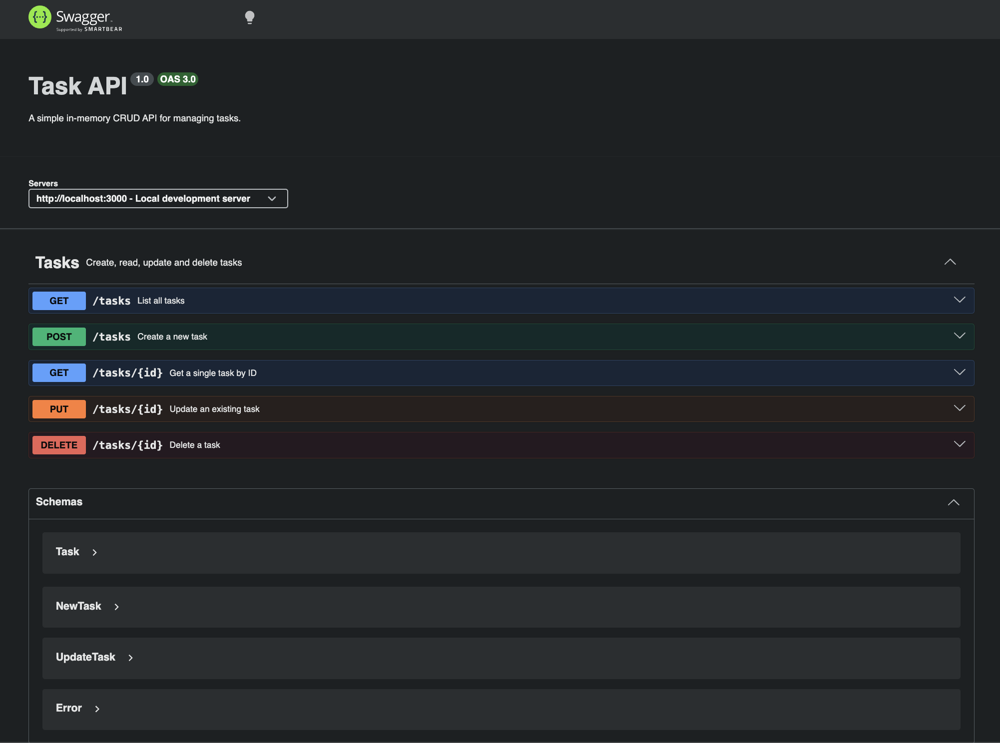

# Task API

A simple **CRUD REST API** for managing tasks, built with **Node.js** and **Express**.
Tasks are stored in memory (no database), making this a lightweight example project for
learning Express routing, validation, and OpenAPI/Swagger documentation.

Each task has the shape:

```json
{ "id": 1, "title": "Buy groceries", "done": false }
```

## Requirements

- [Node.js](https://nodejs.org/) 18 or newer
- npm (bundled with Node.js)

## Install

```bash
git clone https://github.com/<your-username>/FlyRank1.git
cd FlyRank1
npm install
```

## Run

```bash
node server.js
```

The server starts on **http://localhost:3000**.

Interactive Swagger documentation is available at **http://localhost:3000/docs**.

## Endpoints

| Method | Path          | Description                        | Success | Errors |
|--------|---------------|------------------------------------|---------|--------|
| GET    | `/`           | API info (name, version, endpoints)| 200     | —      |
| GET    | `/health`     | Health check                       | 200     | —      |
| GET    | `/tasks`      | List all tasks                     | 200     | —      |
| GET    | `/tasks/:id`  | Get a single task by ID            | 200     | 404    |
| POST   | `/tasks`      | Create a task (`title` required)   | 201     | 400    |
| PUT    | `/tasks/:id`  | Update a task (`title` / `done`)   | 200     | 400, 404 |
| DELETE | `/tasks/:id`  | Delete a task                      | 204     | 404    |

### Error format

Errors return a JSON body of the form:

```json
{ "error": "Task 99 not found" }
```

## Sample request & response

Request:

```bash
curl -i http://localhost:3000/tasks/1
```

Response:

```
HTTP/1.1 200 OK
X-Powered-By: Express
Content-Type: application/json; charset=utf-8
Content-Length: 45
ETag: W/"2d-Gv8HDdZD1sn+UqMseo56OTgQmek"
Date: Tue, 21 Jul 2026 17:16:06 GMT
Connection: keep-alive
Keep-Alive: timeout=5

{"id":1,"title":"Buy groceries","done":false}
```

### More examples

```bash
# Create a task
curl -i -X POST http://localhost:3000/tasks \
  -H 'Content-Type: application/json' \
  -d '{"title":"Learn Express"}'

# Update a task
curl -i -X PUT http://localhost:3000/tasks/1 \
  -H 'Content-Type: application/json' \
  -d '{"done":true}'

# Delete a task
curl -i -X DELETE http://localhost:3000/tasks/1
```

## API documentation (Swagger UI)

Interactive documentation is served at [http://localhost:3000/docs](http://localhost:3000/docs),
generated from [`openapi.json`](./openapi.json).

<!-- Replace the placeholder below with a real screenshot of the Swagger UI.
     Save the image as docs/swagger-screenshot.png and it will render here. -->



> _Screenshot placeholder — run the server, open `/docs`, and capture the page to `docs/swagger-screenshot.png`._

## Project structure

```
.
├── server.js       # Express app and all routes
├── openapi.json    # OpenAPI 3.0 specification
├── package.json
└── README.md
```

## Notes

- Data is stored **in memory**, so all tasks reset to the seed data each time the server restarts.
- IDs auto-increment and are not reused after deletion.
